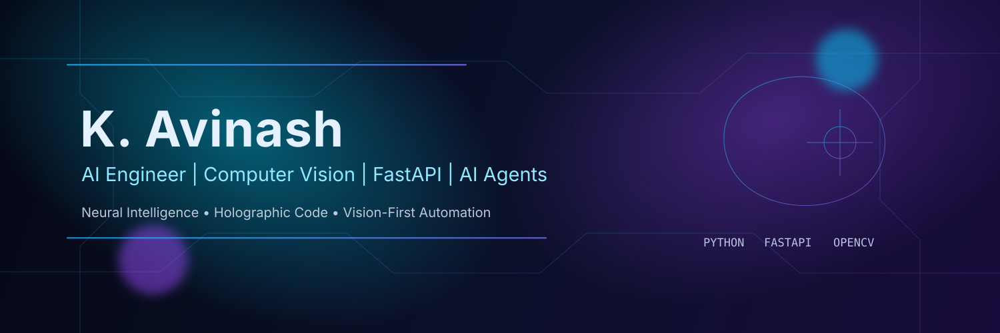

<h1>Hi, I'm K. Avinash 👋</h1>
<h3>AI Engineering Student from Tamil Nadu, India 🇮🇳</h3>

---

## 🚀 About Me

- 🎓 **Education:** B.Sc Computer Science with Artificial Intelligence  
- 💼 **Role:** AI Engineering Student  
- 🌍 **Location:** Tamil Nadu, India  
- 🎯 **Career Goal:** AI Engineer • Computer Vision Engineer • AI Startup Founder  

## 🛠 Tech Stack

### 👨‍💻 Languages

### ⚙️ Frameworks

### 🤖 AI & ML

### 🗄 Databases

### 🧰 Developer Tools

## 📚 Currently Learning

- Python, FastAPI, AI Engineering, Prompt Engineering  
- LangChain, RAG, MCP (Model Context Protocol), AI Agents  
- OpenAI API, Google Gemini API, Vector Databases  
- Computer Vision, OpenCV, Docker  
- Git & GitHub, SQL, PostgreSQL  

## 🔥 Featured Projects

- 🏦 **Bank Management System** — Python OOP + Tkinter + JSON + Logging  
- 🎓 **Student Management API** — FastAPI-based backend API  
- 🤖 **AI Chatbot** — LLM-powered conversational assistant  
- 🧠 **Face Recognition System** — OpenCV + ML based recognition pipeline  
- 👁 **Computer Vision Projects** — image/video processing experiments  
- ⚡ **AI Automation Projects** — productivity and workflow automations  

## 📈 GitHub Analytics

  
  

  

  

  

  
  

## 🏆 Achievements

  

- ✅ Building a strong base in AI engineering and backend systems  
- ✅ Consistently shipping academic and personal AI projects  
- ✅ Focused on becoming a world-class AI + Computer Vision Engineer  

## 🎯 2026 Goals

- 🚀 Build and deploy production-ready AI + CV applications  
- 🧩 Master FastAPI, RAG pipelines, and multi-agent architectures  
- 🏗 Launch the first version of my AI startup product  
- 📈 Grow as an open-source contributor in AI ecosystem  

## 🤝 Connect with Me

- LinkedIn: [Insert your LinkedIn](YOUR_LINKEDIN_URL)  
- Portfolio: [Insert your Portfolio](YOUR_PORTFOLIO_URL)  
- Gmail: [Insert your Gmail](mailto:YOUR_GMAIL_ADDRESS)  
- X (Twitter): [Insert your X handle](YOUR_X_URL)  

## 💡 Quote of the Day

> "The future belongs to those who build it with intelligence, creativity, and consistency."

## ⚡ Fun Facts

- 🧠 I love turning AI concepts into real, usable products.  
- 👁 Computer Vision is my favorite AI domain to experiment with.  
- 🌌 I enjoy futuristic UI/UX and cyberpunk-inspired design aesthetics.  
